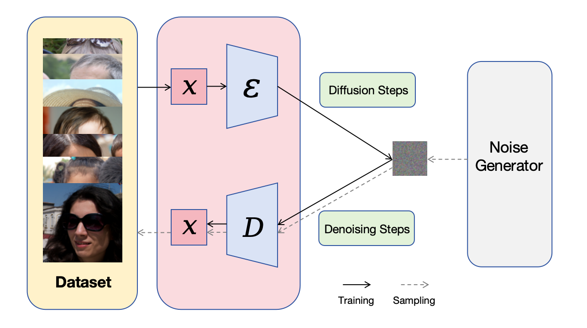
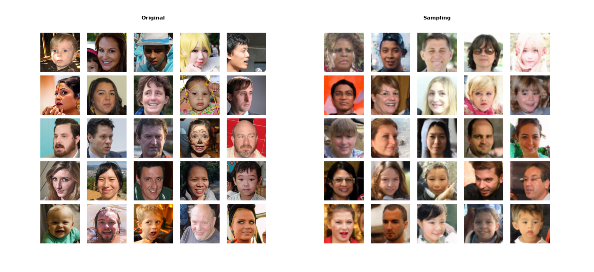

<h1 align="center">
Bootstrapping Diffusion Models
</h1>

Source code for Bootstrapping Diffusion Models.

Collaborators: 
<a href="https://github.com/yangyuxiao-sjtu">YuxiaoYang</a> 
<a href="https://github.com/ZhangTian-Yu">TianyuZhang</a>
<a href="https://github.com/ParkCorsa">ZiqiHuang</a>
<a href="https://github.com/shuzechen">ShuzeChen</a>
<a href="https://github.com/Kr-Panghu">KrCen</a>

### [Paper](https://kr-panghu.github.io/pdfs/CS3964.pdf)

## QuickStart

Install dependencies:

~~~
cd Improved_Diffusion
pip install -e ./guided_diffusion
~~~

Download pre-trained checkpoints: For checkpoint trained by ourselves, download from [google drive](https://drive.google.com/file/d/1i4dhiyLCR9z7uN4OU6Rwuj8-PfDNM8VU/view?usp=drive_link) and put it into `Improved_Diffusion/models/` for sampling.

## Generate Samples with Diffusion

Here we trained [improved-diffusion](https://github.com/openai/improved-diffusion) models on 22000 pictures from [ffhq_dataset_thumbnails128x128](https://github.com/NVlabs/ffhq-dataset). By leveraging diffusion model, we are able to sample mutiple generated faces with good quality.

The following figures are some random-picked samples.

If you want to make your own sample generated faces from random gaussian noise:

~~~
cd ./Improved_Diffusion/guided_diffusion

MODEL_FLAGS="--image_size 64 --num_channels 64 --num_res_blocks 3"
DIFFUSION_FLAGS="--diffusion_steps 1000 --noise_schedule linear"
TRAIN_FLAGS="--lr 1e-4 --batch_size 64"

python3 guided_diffusion/scripts/image_sample.py --model_path models/ema_0.9999.pt $MODEL_FLAGS $DIFFUSION_FLAGS
~~~

If you want to train the diffusion model on your own, follow these instructions:

~~~
MODEL_FLAGS="--image_size 64 --num_channels 64 --num_res_blocks 3"

DIFFUSION_FLAGS="--diffusion_steps 1000 --noise_schedule linear"

TRAIN_FLAGS="--lr 1e-4 --batch_size 64"

python3 scripts/image_train.py --data_dir datasets $MODEL_FLAGS $DIFFUSION_FLAGS $TRAIN_FLAGS
~~~

> 1. If training on multiple GPUs is possible, you can also add `mpiexec -n ` and the corresponding number before `python3`.
> 2. Feel free to edit the parameters.

The code was tested on a RTX4090ti 24GB but should work on other cards with at least 15GB VRAM.

## Bootstrapping

You may get more information about this in our [paper](https://kr-panghu.github.io/pdfs/CS3964.pdf).